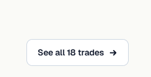

# Naloga 1

Ko smo pognali zaledje aplikacije s komando: `mvn spring-boot:run` smo dobili naslednji error:

To se je zgodilo, ker pom.xml datoteka vsebuje dvojno definicijo istega groupId-ja:

Ko smo to popravili se je zaledje uspešno zagnalo.

Ko smo pognali frontend `npm install` ukaz smo dobili naslednji error, vendar to ni napaka z aplikacijsko kodo vendar z windows sistemom, na katerem smo pognali ukaz, ko smo dodelili ustrezne pravice na windows sistemu, je ukaz deloval normalno:

Če poizkusimi zdaj uporabljati aplikacijo vidimo, da dobivamo CORS težave, saj je še en problem z default port od frontenda, v backendu je nastavljen na 3000, react pa začne na 5173. Ob popravkih tega zdaj spletna aplikacija deluje, le da je brez podatkov.

Ena težava kar smo jo opazili, zdaj ko nima baza nič podatkov je da smo pozabili en statičen tekst zamenjati za dinamičnega:

