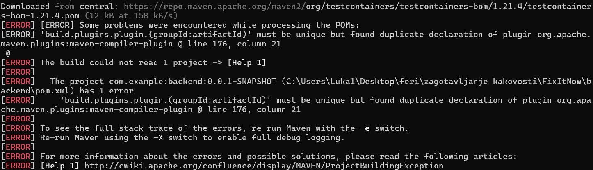
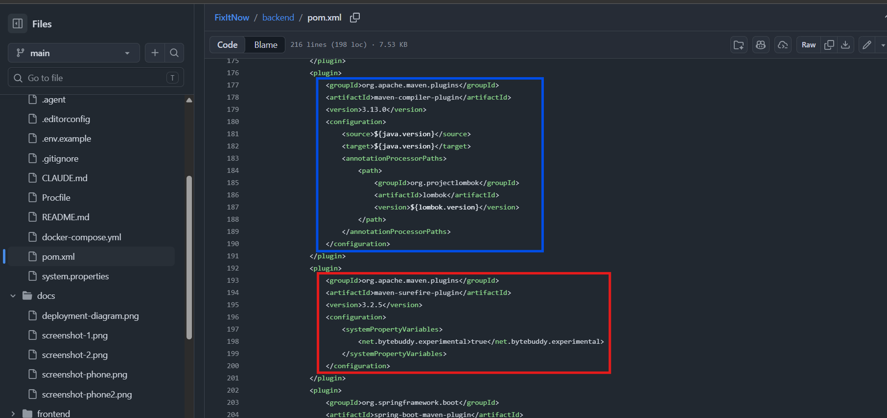
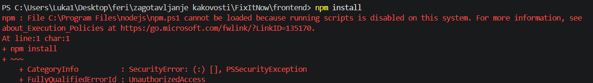

# Naloga 1

Ko smo pognali zaledje aplikacije s komando: `mvn spring-boot:run` smo dobili naslednji error:

To se je zgodilo, ker pom.xml datoteka vsebuje dvojno definicijo istega groupId-ja:

Ko smo to popravili se je zaledje uspešno zagnalo.

Ko smo pognali frontend `npm install` ukaz smo dobili naslednji error, vendar to ni napaka z aplikacijsko kodo vendar z windows sistemom, na katerem smo pognali ukaz, ko smo dodelili ustrezne pravice na windows sistemu, je ukaz deloval normalno:

Standardi:

